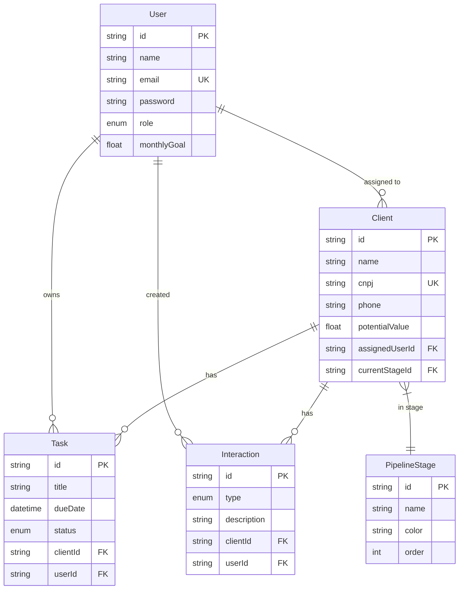

# 🌅 Sunset CRM - Sistema Completo de Vendas


Sistema completo de CRM para distribuidoras, focado em velocidade, beleza e usabilidade extrema para vendedores e gestores.

---

## ✨ Funcionalidades Principais

### ✅ Implementadas

- **🔐 Autenticação Completa**
  - Login com NextAuth.js
  - Roles (Gestor / Vendedor)
  - Proteção de rotas via middleware
  - Sessões JWT seguras

- **📊 Dashboard (Torre de Controle)**
  - Card de Meta do Mês com barra de progresso visual
  - Card de Tarefas Urgentes (contador pulsante vermelho)
  - Card de Novos Leads (clientes em prospecção)
  - Taxa de conversão em tempo real
  - Tarefas recentes e resumo do funil

- **🎯 Kanban Dinâmico**
  - Drag & Drop fluido com @hello-pangea/dnd
  - Colunas configuráveis (funil dinâmico)
  - Cards minimalistas de cliente
  - Botão WhatsApp direto nos cards
  - Atualização otimista da UI
  - Feedback visual ao mover

- **🎨 Design Profissional**
  - Shadcn/ui components
  - Gradientes modernos
  - Animações suaves
  - Sidebar fixa com navegação
  - Tema moderno e limpo

### 🚧 Próximas Features

- Visão 360º do Cliente (dossiê completo + timeline)
- Calendário visual de tarefas
- Relatórios gerenciais com gráficos
- Configuração personalizada do funil
- Notificações em tempo real
- App mobile (futuro)

---

## 🚀 Quick Start

### Pré-requisitos

- Node.js 18+
- PostgreSQL 14+ (ou Docker)

### Instalação Rápida

```bash
# 1. Dependências já instaladas ✅
# (527 pacotes)

# 2. Instalar Docker (recomendado)
brew install --cask docker

# 3. Iniciar PostgreSQL
docker compose up -d

# 4. Configurar banco
npx prisma migrate dev --name init
npx prisma db seed

# 5. Iniciar app
npm run dev
```

**Acesse**: http://localhost:3000

**Login**: `admin@sunset.com` / `123456`

Para instruções detalhadas, veja **[SETUP.md](./SETUP.md)**

---

## 📁 Estrutura do Projeto

```
app_sunset/
├── app/
│   ├── (dashboard)/          # Rotas protegidas
│   │   ├── dashboard/        # ✅ Dashboard principal
│   │   ├── pipeline/         # ✅ Kanban de vendas
│   │   ├── clients/          # 🚧 Gestão de clientes
│   │   ├── calendar/         # 🚧 Agenda
│   │   ├── reports/          # 🚧 Relatórios (Gestor)
│   │   └── settings/         # 🚧 Configurações
│   ├── api/                  # API Routes
│   │   ├── auth/            # ✅ NextAuth
│   │   ├── pipeline/        # ✅ Kanban APIs
│   │   └── dashboard/       # ✅ Stats API
│   ├── login/               # ✅ Tela de login
│   └── globals.css          # ✅ Estilos globais
├── components/
│   ├── ui/                  # ✅ Shadcn/ui components
│   ├── dashboard/           # ✅ Stats cards
│   └── kanban/              # ✅ Kanban components
├── lib/
│   ├── prisma.ts           # ✅ Cliente Prisma
│   ├── auth.ts             # ✅ Config NextAuth
│   ├── session.ts          # ✅ Auth helpers
│   ├── utils.ts            # ✅ Utilitários
│   └── validations.ts      # ✅ Schemas Zod
├── prisma/
│   ├── schema.prisma       # ✅ Modelo de dados
│   └── seed.ts             # ✅ Dados iniciais
└── middleware.ts           # ✅ Proteção de rotas
```

---

## 🎯 Stack Tecnológica

| Categoria | Tecnologia | Versão |
|-----------|-----------|--------|
| **Framework** | Next.js | 14.2 |
| **Language** | TypeScript | 5.x |
| **Database** | PostgreSQL | 16 |
| **ORM** | Prisma | 6.19 |
| **Auth** | NextAuth.js | 4.24 |
| **Styling** | Tailwind CSS | 3.4 |
| **Components** | Shadcn/ui | Latest |
| **Drag & Drop** | @hello-pangea/dnd | 17.0 |
| **Charts** | Recharts | 2.15 |
| **Validation** | Zod | 3.24 |

---

## 📊 Modelo de Dados



---

## 🎨 Screenshots

### Tela de Login
Card centralizado com gradiente moderno, validação em tempo real e feedback visual.

### Dashboard
Cards de estatísticas com progresso da meta, tarefas urgentes pulsantes e navegação rápida.

### Pipeline Kanban
Drag & drop fluido, colunas configuráveis, botões WhatsApp integrados.

---

## 🔒 Segurança

- ✅ Senhas com hash bcrypt (salt rounds: 10)
- ✅ JWT tokens para sessões
- ✅ Middleware de proteção de rotas
- ✅ Validação server-side com Zod
- ✅ Variáveis de ambiente para secrets
- ✅ CSRF protection via NextAuth

---

## 🧪 Dados de Teste

O seed cria automaticamente:

**Usuários:**
- Gestor: `admin@sunset.com` / `123456`
- Vendedor 1: `joao@sunset.com` / `123456`
- Vendedor 2: `maria@sunset.com` / `123456`

**Funil padrão:**
1. Prospecção (azul)
2. Negociação (amarelo)
3. Proposta Enviada (roxo)
4. Fechamento (verde)

**8 Clientes** distribuídos pelo funil
**Tarefas** pendentes e atrasadas

---

## 📝 Scripts Disponíveis

```bash
# Desenvolvimento
npm run dev              # Inicia dev server (port 3000)

# Build
npm run build           # Build de produção
npm start               # Inicia produção

# Database
npx prisma studio       # UI visual do banco
npx prisma migrate dev  # Criar migration
npx prisma db seed      # Popular banco
npx prisma migrate reset # Reset completo

# Docker
docker compose up -d    # Inicia PostgreSQL
docker compose down     # Para PostgreSQL
docker compose logs -f  # Ver logs
```

---

## 🐛 Troubleshooting

Consulte [SETUP.md](./SETUP.md) para guia completo de resolução de problemas.

**Problemas comuns:**
- Banco não conecta → Verificar se PostgreSQL está rodando
- Erro de permissão npm → `sudo chown -R $(id -u):$(id -g) ~/.npm`
- Prisma Client não encontrado → `npx prisma generate`

---

## 📈 Roadmap

- [ ] v1.1: Cliente 360º com timeline
- [ ] v1.2: Calendário visual
- [ ] v1.3: Relatórios com gráficos
- [ ] v1.4: Configuração de funil personalizado
- [ ] v2.0: Notificações push
- [ ] v2.1: Integração WhatsApp Business API
- [ ] v3.0: Mobile app (React Native)

---

## 👥 Papéis e Permissões

| Funcionalidade | Vendedor | Gestor |
|----------------|----------|--------|
| Dashboard | ✅ | ✅ |
| Pipeline | ✅ (seus clientes) | ✅ (todos) |
| Clientes | ✅ (seus clientes) | ✅ (todos) |
| Agenda | ✅ (suas tarefas) | ✅ (todas) |
| Relatórios | ❌ | ✅ |
| Configurações | ❌ | ✅ |

---

## 📄 Licença

Projeto proprietário - Sunset CRM © 2024

---

## 🙏 Créditos

- Framework: [Next.js](https://nextjs.org/)
- Components: [Shadcn/ui](https://ui.shadcn.com/)
- Icons: [Lucide](https://lucide.dev/)
- Drag & Drop: [hello-pangea/dnd](https://github.com/hello-pangea/dnd)

---

**Desenvolvido com ❤️ para revolucionar vendas em distribuidoras**
